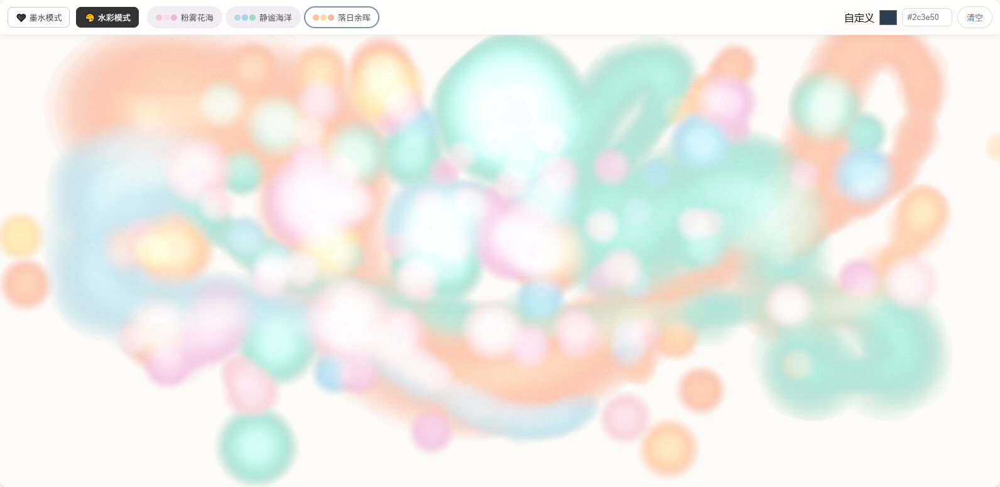

# 🎨 水彩疗愈画板 (Watercolor Healing Canvas)

> 一款以「指尖触碰画布，时间绽放水彩」为核心理念的解压型绘画 Web 应用。

[](https://2convallaria.github.io/Watercolor-Healing-Canvas/)


##  在线体验

 **[点击这里直接体验水彩疗愈画板](https://2convallaria.github.io/Watercolor-Healing-Canvas/)**  
*(支持 PC 鼠标拖拽 / 移动端手指触控)*



---

##  项目概述

用户按住画布时，水彩晕染随按压时长逐渐扩散（**10秒封顶160px**），松手后以不规则水彩滴形态留存；配合柔和色系、水彩边缘沉积质感与柔光混色，营造疗愈、放松的创作体验。

技术选型采用 **原生 JavaScript + Canvas 2D + 单文件 HTML** 架构，无需任何框架与依赖，一次点击即可在任意现代浏览器（桌面端 / 移动端）运行，兼顾移动端触摸性能与部署的极简性。

##  核心特性

-  **时间驱动生长**：按压时长直接映射为晕染半径，松手后形态自然留存。
-  **不规则水彩滴**：极坐标随机扰动 + 二次贝塞尔曲线，拒绝死板圆形，边缘有毛刺感。
-  **径向渐变晕染**：中心极淡、边缘沉积，模拟真实水彩“颜料向边缘堆积”的物理特性。
-  **色彩混色策略**：通过“正片叠底”与“柔光”混合模式，颜色叠加通透不脏。
-  **移动端性能优先**：从架构上杜绝全屏重绘与重滤镜，100ms 节流，流畅运行不卡顿。
-  **多端完整兼容**：Pointer Events 统一事件源，防多指冲突、防误触。

## 技术架构

| 层级 | 核心职责 | 关键实现 |
| :--- | :--- | :--- |
| **UI 表现层** | 提供用户交互界面 | 顶部工具栏、预设调色板、自定义颜色、清空按钮 |
| **交互控制层** | 统一处理多端输入事件 | Pointer Events、单指针状态机、防多指冲突 |
| **业务逻辑层** | 处理核心数据与规则 | 按压时长映射、形状生成、颜色空间转换 |
| **渲染引擎层** | 负责画布绘制 | Canvas 2D、径向渐变、混合模式、局部重绘 |
| **性能调度层** | 保障流畅度与稳定性 | setTimeout 节流、rAF、定时器回收、DPR 适配 |

*(详细的底层实现细节、关键设计决策与性能优化清单，请参阅 [ARCHITECTURE.md](./ARCHITECTURE.md))*

##  快速开始

直接双击打开 `index.html` 即可体验，或通过以下命令在本地运行：

```bash
# 使用 Python 快速启动本地服务
python -m http.server 8080
# 访问 http://localhost:8080
